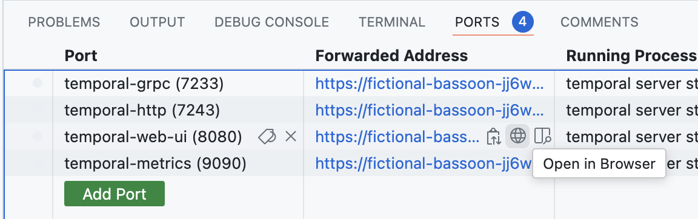

# Order fulfill sandbox

This repository is built to be played with in a GitHub Codespace.

To get started, you can launch a codespace by using the button at the top of the repository,
or by clicking [here](https://codespaces.new/XaF/temporal-order-fulfill/tree/devcontainer?quickstart=1).

## Playing in the codespace

### Demos

A few demos are provided for you to see what Temporal can offer. You can launch them by using the
terminal in the codespace and calling:

- `npm run demo.0` for a demo that launches workflows while simulating a failing API (inventory service); this will show you how Temporal can handle failures and retries, and how all of your workflows will automatically continue their process as soon as the API is available again.
- `npm run demo.1` for a demo that launches workflows while some of the input data is invalid; this will show you how Temporal can handle bug fixing "on the fly", as changing the code path in the activities that receive invalid that will all of a sudden allow for all activities to reconvene.

### Manual twiddling

You can also manually twiddle with the code to see how Temporal behaves.
Any change you are making to the code will automatically rebuild your worker and connect it back to the Temporal server.
You can thus:
- Introduce voluntary errors in your code, run workflows, fix the errors, and see your workflows proceed as if nothing happened.
- Create new workflows, new activities, new signals, and see how they interact with each other.
- Bug in workflow, add `throw Error('workflow bug!')` in workflow code
- Play with the included scenarios:
   - `npm run scenario.0` sets your worker to use the default `workflows.ts` file
   - `npm run scenario.1` sets your worker to use the `demo/workflows1.ts` file, which includes a happy path scenario
   - `npm run scenario.2` sets your worker to use the `demo/workflows2.ts` file, which includes a human in the loop scenario (requires a `approveOrder` signal to be sent for the workflows to proceed if the order total price is above 10000$)
   - `npm run scenario.3` sets your worker to use the `demo/workflows3.ts` file, which includes a scenario where orders need to be approved or they will expire (i.e. same as `scenario.2`, but with a timeout)

#### Start workflows from the SDK

To start workflows, you can use the helper `npm run workflow -- [options]` with its available options:
- `--numOrders` to specify the number of orders to create (default is 1)
- `--invalidPercentage` to specify the percentage of invalid orders to create (default is 0)
- `--expensivePercentage` to specify the percentage of expensive (>10000$) orders to create (default is 0)
- `--expiredCardPercentage` to specify the percentage of orders with expired credit cards to create (default is 0)

e.g.
- `npm run workflow` will create 1 valid order.
- `npm run workflow -- --numOrders 10` will create 10 valid orders.
- `npm run workflow -- --numOrders 10 --invalidPercentage 20` will create 10 orders, 20% of which will be invalid, and the rest will be valid.
- `npm run workflow -- --numOrders 10 --invalidPercentage 20 --expensivePercentage 10 --expiredCardPercentage 5` will create 10 orders, 20% of which will be invalid, 10% of which will be expensive, and 5% of which will have expired credit cards. The percentages are calculated on the total number of orders and thus can overlap.

#### Affecting the workflow runs

You can also use:
- `npm run enable-item-names-bug-fix` / `npm run disable-item-names-bug-fix` to enable or disable the bug fix for the item names in the `api.ts` file.
- `npm run enable-inventory-service` / `npm run disable-inventory-service` to enable or disable the inventory service.

#### Using the CLI

You can also use the `temporal` CLI directly to send commands to the temporal server. You will need to use the `default` namespace and the `sample-order-fulfill` task queue. Here are a few commands you can play with:
- List all the workflows: `temporal workflow list`
- Execute a new workflow:
  ```bash
  temporal workflow execute -n default -t sample-order-fulfill -w my-workflow-id --type OrderFulfillWorkflow --input '{
    "items": [
       {
          "itemName": "Fragrance Set",
          "itemPrice": 125,
          "quantity": 42
       },
       {
          "itemName": "Eau de Toilette Gift Set",
          "itemPrice": 149,
          "quantity": 38
       }
    ],
    "payment": {
       "creditCard": {
          "number": "1234 5678 1234 5678",
          "expiration": "12/25"
       }
    }
  }
  ```
- Signal a running workflow: `temporal workflow signal -w my-workflow-id --name approveOrder`

### Accessing the UI

GitHub Codespaces allow to expose ports, which means you can access the Temporal Web UI directly from your codespace!

If you click on the `ports` button on the bottom section of the codespace, you will see a list of 4 ports, with one named `Temporal Web UI`.
By clicking on the little globe icon next to it, you will be able to open the Temporal Web UI in a new tab.


_Note: for some reason, the UI cannot be open in a codespace tab, so you will need to open it in a new browser tab._

### Logs

If you are curious, you can see the logs in `/tmp/logs` in your codespace.

The following command allows you to look at the logs of the temporal worker in real time: `tail -f /tmp/logs/temporal-worker.log`